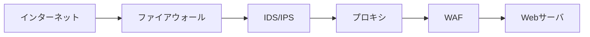

## 概要

本章では、ネットワーク通信の安全性を確保するための基礎理論と実践技術を体系的に解説する。現代の情報システムはインターネットや社内LANを介して膨大なデータをやり取りしており、通信路の安全性が脅威に晒される場面は多岐にわたる。盗聴・改ざん・サービス妨害・不正侵入などの攻撃手法と、それに対抗するTLS（暗号化）、VPN（仮想専用線）、IDS/IPS（侵入検知・防御）、プロキシ（中継・制御）などの防御技術について、仕組み・導入ポイント・運用上の注意点まで詳しく学ぶ。

ネットワークセキュリティは「境界防御」から「ゼロトラスト」へと進化しており、単一の技術だけでなく多層的な防御設計が求められる。基礎理論から最新動向まで、実務・試験対策の両面で役立つ知識を身につけることを目指す。

---

## 1. ネットワーク層の主要脅威

ネットワーク層は、物理的なケーブルやWi-FiからTCP/IPプロトコルまで、データが実際に流れる経路を指す。ここで発生する脅威は、情報の盗聴・改ざん・妨害・不正侵入など多岐にわたる。

### 1.1 パケット盗聴・改ざん

- **盗聴（スニッフィング）**
  - 攻撃構造：LAN内やWi-Fiなどの通信路で、攻撃者がパケットキャプチャツール（例：Wireshark）を使い、送受信されるデータ（ID・パスワード・クレジットカード情報等）を傍受する。特に暗号化されていない通信（HTTP, Telnet等）は容易に解析される。
  - 対策：TLS/SSLによる暗号化（HTTPS化）、VPNトンネルの利用。暗号化通信では、盗聴されても内容が解読できない。
  - 実践例：社内Wi-FiはWPA2以上の暗号化を必須とし、Webサービスは必ずHTTPSを導入する。

- **改ざん（MITM：Man-in-the-Middle）**
  - 攻撃構造：攻撃者が通信経路の中間に入り、パケット内容を改変したり偽装した情報を送り込む。DNSキャッシュポイズニングやARPスプーフィングも代表的な手法。
  - 対策：証明書ピンニング（クライアント側で正しい証明書を検証）、HSTS（HTTP Strict Transport Security）による強制HTTPS化、VPNによる通信路の秘匿化。
  - 実践例：スマホアプリはサーバ証明書のピンニングを実装し、WebサーバはHSTSヘッダを返す。

### 1.2 サービス妨害（DoS/DDoS）

- 攻撃構造：攻撃者が大量のリクエストやパケット（SYN Flood, UDP Flood等）を送りつけ、サーバやネットワーク機器のリソースを枯渇させてサービスを停止・遅延させる。分散型（DDoS）は複数の踏み台PCから同時攻撃。
- 対策：レートリミット（単位時間あたりのリクエスト制限）、WAF（Web Application Firewall）による異常検知・遮断、CDN（Content Delivery Network）による負荷分散、ブラックホールルーティング（攻撃トラフィックの破棄）。
- 実践例：クラウドサービスではDDoS対策オプションを有効化し、WAFで攻撃パターンを自動遮断。

### 1.3 不正アクセス・踏み台

- 攻撃構造：TelnetやFTPなど暗号化されていない脆弱なプロトコル、初期設定のままの機器、パスワード漏洩などを突いてネットワーク内部に侵入。侵入後は踏み台として他のシステムへの攻撃に利用される。
- 対策：SSH（Secure Shell）など暗号化プロトコルの利用、不要サービスの停止、ファイアウォールによるアクセス制限、初期パスワードの変更。
- 実践例：IoT機器やルーターは初期パスワードを必ず変更し、外部からの管理画面アクセスはファイアウォールで遮断。

---

## 2. 防御技術の基礎

ネットワーク防御は、複数の技術を組み合わせて「多層防御」を実現する。各技術の仕組み・導入ポイントを理解しよう。

| 技術         | 解説                                                                                                                              | 代表ツール・規格        |
| ------------ | --------------------------------------------------------------------------------------------------------------------------------- | ----------------------- |
| **TLS/SSL**  | 通信路を暗号化し、第三者による盗聴・改ざんを防止。証明書によるサーバ認証でなりすましも防ぐ。HTTPSはWeb通信の標準。                | OpenSSL, Let's Encrypt  |
| **VPN**      | 公衆ネットワーク上に仮想専用線（トンネル）を構築し、拠点間・リモートアクセスの安全性を確保。IPsec, SSL-VPN, WireGuard等方式あり。 | WireGuard, OpenVPN      |
| **IDS/IPS**  | IDSは侵入検知、IPSは侵入防御。シグネチャ（既知攻撃パターン）や振る舞い（異常検知）でネットワーク内外からの攻撃を検出・遮断。      | Snort, Suricata, Wazuh  |
| **プロキシ** | クライアントとサーバの間に立ち、通信内容を中継・監視・制御。アクセスログ取得やフィルタリング、キャッシュ機能も持つ。              | Squid, nginx, Zscaler   |
| **WAF**      | Webアプリ層の攻撃（XSS, SQLi等）を検知・遮断。HTTPリクエストの内容を解析し、異常なパターンをブロック。                            | AWS WAF, F5, Cloudflare |

### 多層防御

各層で異なる役割を担い、攻撃の侵入・拡大を防ぐ。

---

## 3. 通信防御の設計ポイント

ネットワーク防御は「設計思想」が重要。単なる技術導入だけでなく、運用・監査・継続的改善が不可欠。

- **ゼロトラストネットワーク**：従来の「社内＝安全、外部＝危険」という境界防御から、全ての通信・ユーザー・端末を疑い、都度認証・暗号化する設計へ。VPNやTLSで通信路を守り、ID管理・アクセス制御を徹底。
- **多層防御（Defense in Depth）**：ファイアウォール（外部遮断）、IDS/IPS（侵入検知・防御）、WAF（Web層防御）、プロキシ（監視・制御）など複数技術を組み合わせ、単一障害点を排除。
- **ログ・監査**：通信履歴やアクセスログを記録・分析し、インシデント（不正アクセス・情報漏洩等）を早期発見。SIEM（Security Information and Event Management）で統合管理。
- **脆弱性管理**：ネットワーク機器・ソフトウェアの定期アップデート、脆弱性スキャン、パッチ適用。古い機器や未更新ソフトは攻撃対象となりやすい。
- **教育・運用体制**：管理者・利用者へのセキュリティ教育、インシデント対応手順の整備も重要。

---

## 4. 最新動向と実践

- **TLS 1.3の普及**：従来より高速・安全な暗号化通信を実現。暗号化方式の自動交渉、前方秘匿性（PFS）など強化ポイント多数。WebサービスはTLS 1.3対応が推奨。
- **VPNの多様化**：リモートワークやクラウド利用の拡大に伴い、SSL-VPNやWireGuardなど柔軟なVPN設計が求められる。ゼロトラスト型VPN（ZTNA）も登場。
- **IDS/IPSのAI活用**：従来のシグネチャ型に加え、機械学習による異常検知（未知の攻撃パターン検出）が進化。大量ログから自動で脅威を抽出。
- **クラウド型WAF/プロキシ**：オンプレミスだけでなく、SaaS型のセキュリティサービス（Cloudflare, Zscaler等）が普及。導入・運用負荷が低く、グローバルな防御が可能。
- **IoT・5G時代の新課題**：IoT機器の脆弱性、5G通信の新たな攻撃面など、今後のネットワーク防御はより広範な視点が必要。

---

## 5. 試験対策の観点

- TLS／VPN／IDS/IPS／プロキシの「役割・仕組み・導入ポイント」を図解・事例で整理
- DoS/DDoSの攻撃構造（SYN Flood, UDP Flood等）と防御策（WAF, CDN,ブラックホール等）
- ゼロトラスト・多層防御の設計思想と実践例
- ログ・監査によるインシデント検知・対応の流れ
- 最新動向（TLS 1.3, AI型IDS, クラウド型WAF等）の特徴と導入メリット

実務・試験ともに「仕組み→攻撃例→防御策→運用ポイント」の流れで理解することが重要。
