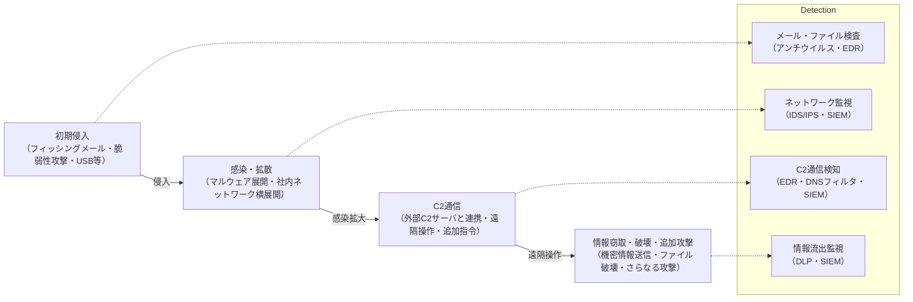
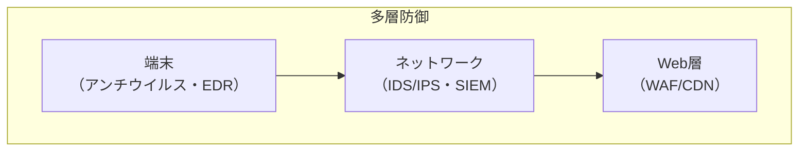

## 概要

本章では、現代のサイバー攻撃手法（マルウェア、DoS/DDoS、C2通信など）と、それに対抗する防衛策（検知・遮断・対応）の理論と実践を体系的に解説する。
攻撃の構造・流れ・被害例から、IOC（Indicator of Compromise）やEDR（Endpoint Detection and Response）など最新の検知・対応技術まで、実務・試験対策の両面で役立つ知識を身につける。
サイバー攻撃は年々高度化・巧妙化しており、単なるウイルス対策だけでは防ぎきれない。
攻撃の全体像（侵入→感染→拡散→遠隔操作→情報窃取）を理解し、各段階での検知・防御・対応を多層的に設計することが重要である。

---

## 1. 主要な攻撃手法

サイバー攻撃は多様な手法が組み合わされる。代表的な攻撃とその仕組み・対策を詳しく解説する。

### 1.1 マルウェア（ウイルス・ワーム・トロイの木馬等）

- **攻撃構造**：
  - マルウェアは「悪意あるプログラム」の総称。ウイルスは自己複製し他ファイルに感染、ワームはネットワーク経由で自動拡散、トロイの木馬は正規ソフトを装い侵入する。
  - 感染経路はメール添付、Webダウンロード、USBメモリ、脆弱性を突いた自動感染など。
  - 近年は「ランサムウェア」（ファイル暗号化＋身代金要求）や「ボットネット」（遠隔操作端末群化）が主流。
- **被害例**：
  - 企業の業務ファイルが暗号化され復旧不能、顧客情報の漏洩、端末が攻撃の踏み台化。
- **対策**：
  - アンチウイルスソフト導入・定期スキャン、OS・ソフトのアップデート（脆弱性修正）、権限管理（管理者権限の限定）、不審メール・添付ファイルの開封禁止。
  - 実践例：社内端末は自動アップデート・USB利用制限・アンチウイルス一括管理。

### 1.2 DoS/DDoS攻撃

- **攻撃構造**：
  - DoS（Denial of Service）は単一端末から大量リクエストでサービス妨害。DDoS（Distributed DoS）は複数端末（ボットネット等）から同時攻撃。
  - SYN Flood（TCP接続要求の大量送信）、UDP Flood（無意味なパケット送信）など手法多数。
- **被害例**：
  - Webサイトの長時間停止、業務システムの利用不能、顧客サービスの信頼失墜。
- **対策**：
  - WAF（Web Application Firewall）による異常検知・遮断、CDN（Content Delivery Network）による負荷分散、レートリミット（単位時間あたりのリクエスト制限）、ブラックホールルーティング（攻撃トラフィックの破棄）、クラウド型DDoS対策サービス。
  - 実践例：クラウドサービスはDDoS対策オプションを有効化、WAFで攻撃パターン自動遮断。

### 1.3 C2通信（Command & Control）

- **攻撃構造**：
  - マルウェア感染端末が外部の攻撃者サーバ（C2サーバ）と通信し、遠隔操作や追加攻撃指令を受ける。C2通信はHTTP/HTTPS、DNS、独自プロトコルなど多様。
  - 攻撃者はC2経由で情報窃取、追加マルウェアのダウンロード、他端末への横展開を指示。
- **被害例**：
  - 機密情報の外部送信、社内ネットワーク全体への感染拡大。
- **対策**：
  - ネットワーク監視（IDS/IPS）、DNSフィルタリング（不審ドメイン遮断）、EDRによる異常通信検知。
  - 実践例：EDRでC2通信を自動隔離、SIEMで不審な外部通信を相関分析。

---

## 2. 攻撃の流れと検知ポイント

攻撃は複数段階で進行する。各段階での検知・遮断が重要。

1. 初期侵入：フィッシングメール、脆弱性攻撃、USB等で端末に侵入。
2. 感染・拡散：マルウェア展開、社内ネットワークへの横展開。
3. C2通信：外部サーバと連携し、遠隔操作・追加攻撃指令。
4. 情報窃取・破壊・追加攻撃：機密情報送信、ファイル破壊、さらなる攻撃。

各段階での検知・遮断が重要。特にC2通信の検知は被害拡大防止の鍵。

### 攻撃の流れ

---

## 3. 防衛技術の基礎

攻撃を防ぐには、複数の技術を組み合わせて「多層防御」を実現する。各技術の仕組み・導入ポイントを理解しよう。

| 技術               | 解説                                                                     | 代表ツール・規格         |
| ------------------ | ------------------------------------------------------------------------ | ------------------------ |
| **アンチウイルス** | 既知マルウェアのシグネチャ検知・隔離。未知型は振る舞い検知も活用。       | Windows Defender, ESET   |
| **EDR**            | 端末の振る舞い監視・異常検知・自動隔離。感染拡大やC2通信も検知。         | CrowdStrike, SentinelOne |
| **SIEM**           | ログ統合・相関分析によるインシデント検知。複数システムのログを一元管理。 | Splunk, Wazuh            |
| **WAF/CDN**        | Web層の攻撃遮断・負荷分散。DoS/DDoS対策にも有効。                        | AWS WAF, Cloudflare      |
| **IOC管理**        | 攻撃兆候（IP,ドメイン,ファイルハッシュ等）の収集・共有。                 | MISP, VirusTotal         |

### 多層防御

各層で異なる役割を担い、攻撃の侵入・拡大を防ぐ。

---

## 4. 実践的な防衛策

- **多層防御**：端末（アンチウイルス・EDR）、ネットワーク（IDS/IPS・SIEM）、Web層（WAF/CDN）で複数技術を併用。単一障害点を排除。
- **定期スキャン・アップデート**：OS・ソフト・ウイルス定義の最新化。脆弱性放置は攻撃リスク増大。
- **権限管理・最小権限原則**：不要な管理権限・共有フォルダの排除。管理者権限は限定的に。
- **インシデント対応体制**：CSIRT（Computer Security Incident Response Team）設置、初動対応手順の整備。被害拡大防止。
- **IOC活用**：攻撃兆候（IP,ドメイン,ハッシュ等）を収集・共有し、早期検知・遮断。MISP等で情報連携。
- **教育・訓練**：利用者・管理者へのセキュリティ教育、インシデント対応訓練も重要。

---

## 5. 最新動向と課題

- **EDR/XDRの普及**：EDRは端末、XDRはクラウド・ネットワーク全体を横断的に監視・防御。複数システムの連携で高度な検知・対応。
- **AI型マルウェア検知**：未知の攻撃パターンも機械学習で検知。従来型アンチウイルスの限界を補完。
- **攻撃の高度化・自動化**：ファイルレス攻撃（ファイルを残さずメモリ上で動作）、サプライチェーン攻撃（委託先・部品経由の侵入）等への対応強化。
- **IOC共有の国際連携**：MISP等によるグローバルな攻撃情報共有。国際的な連携で早期検知・遮断。
- **EDR・SIEM・IOCの連携強化**：複数技術を組み合わせ、インシデント対応力を高める。

---

## 6. 基礎知識チェック

### 設問 - Level 1

1. 「悪意あるプログラム」の総称は何と呼ばれますか？
2. 自己複製し、他ファイルに感染するタイプのマルウェアを何と呼びますか？
3. ファイルを暗号化し、その解除と引き換えに金銭を要求するマルウェアを何と呼びますか？
4. 複数の踏み台PCから同時に大量のリクエストを送りつけ、サービスを停止させる攻撃を何と呼びますか？
5. マルウェア感染端末が外部の攻撃者サーバーと通信し、遠隔操作や追加攻撃指令を受ける通信を何と呼びますか？
6. サイバー攻撃の流れにおいて、被害拡大防止の鍵となる検知ポイントは何ですか？
7. 既知マルウェアのシグネチャ検知や振る舞い検知を行うソフトウェアは何ですか？
8. 端末の振る舞いを監視し、異常を検知して自動で隔離するセキュリティ技術は何ですか？
9. 複数のシステムから出力されるログを一元的に収集・統合し、相関分析によってインシデントを検知するシステムは何ですか？
10. 攻撃兆候（IPアドレス、ドメイン、ファイルハッシュなど）を収集・共有するための管理を何と呼びますか？
11. CSIRTは何の略で、どのような役割を担うチームですか？

### 設問 - Level 2

1. マルウェアの分類において、「ウイルス」「ワーム」「トロイの木馬」のそれぞれの特徴と主な感染経路の違いを説明してください。
2. DoS攻撃とDDoS攻撃の根本的な違いを説明し、DDoS攻撃において攻撃者が利用する「ボットネット」とは何かを簡潔に説明してください。
3. C2通信（Command & Control）がセキュリティ上なぜ危険なのか、その目的とC2通信を検知するための技術的対策を2つ挙げてください。
4. サイバー攻撃は「初期侵入」「感染・拡散」「C2通信」「情報窃取・破壊・追加攻撃」という複数段階で進行します。これらの段階を把握することの重要性を説明してください。
5. EDR（Endpoint Detection and Response）が従来のアンチウイルスソフトウェアと比較して優れている点や、検知・対応における具体的な役割を説明してください。
6. SIEM（Security Information and Event Management）が多層防御において果たす役割と、その主要な機能（ログ統合、相関分析など）がどのように脅威検知に貢献するか説明してください。
7. 「多層防御」という考え方がサイバーセキュリティにおいて不可欠とされる理由を、単一の防御策の限界と関連付けて説明してください。
8. 組織のセキュリティ対策において、「権限管理・最小権限原則」が重要な理由を、攻撃者がシステム内部に侵入した場合の被害拡大防止の観点から説明してください。
9. IOC（Indicator of Compromise）の具体的な要素を3つ挙げ、IOCを組織内で活用することのメリットを説明してください。
10. 最新動向として注目される「EDR/XDR」について、EDRとXDRの違いを説明し、XDRが対応する範囲の広がりがどのようなメリットをもたらすか説明してください。
11. AI型マルウェア検知が、従来型アンチウイルスと比較して優れている点と、克服すべき課題をそれぞれ簡潔に説明してください。
12. 攻撃の高度化の一例である「ファイルレス攻撃」とはどのようなものか説明し、従来のアンチウイルスで検知が難しい理由を簡潔に述べてください。

---

### 回答 - Level 1

1. マルウェア。
2. ウイルス。
3. ランサムウェア。
4. DDoS（Distributed Denial of Service）攻撃。
5. C2通信（Command & Control）。
6. C2通信の検知。
7. アンチウイルスソフト。
8. EDR（Endpoint Detection and Response）。
9. SIEM（Security Information and Event Management）。
10. IOC（Indicator of Compromise）管理。
11. Computer Security Incident Response Team（コンピュータセキュリティインシデント対応チーム）。サイバーセキュリティに関するインシデント発生時に、組織横断的に対応を調整・指揮する役割を担います。

### 回答 - Level 2

1.  **ウイルス:** 自己複製能力を持ち、他の実行可能ファイルやドキュメントに感染して拡散します。主に感染ファイルを介して人為的な操作や共有で感染が広がります。**ワーム:** 自己複製能力を持ち、ネットワークの脆弱性などを利用して単独で自動的に拡散します。メールの添付ファイルやネットワーク共有を介して感染します。**トロイの木馬:** 正規の有用なソフトウェアに見せかけてユーザーに実行させ、内部で悪意のある活動を行うマルウェアです。自己増殖能力はなく、ユーザーの意図しない情報窃取やバックドア設置などを行います。Webサイトからのダウンロードやメール添付で侵入します。
2.  **DoS攻撃**は単一の攻撃元（または少数の攻撃元）から大量のリクエストを送りつけ、サービスを停止させることを目的とします。一方、**DDoS攻撃**は複数の分散されたコンピューター（ボットネットなど）から同時に攻撃を行い、より大規模かつ効果的にサービス停止を狙います。**ボットネット**とは、攻撃者がマルウェアなどを用いて遠隔操作可能にした多数のコンピューター群（ゾンビPC）を指し、これらがDDoS攻撃の踏み台として利用されます。
3.  C2通信は、マルウェアに感染した端末が、攻撃者の制御下にある外部のC2サーバーと通信し、**遠隔操作、追加マルウェアのダウンロード、機密情報の外部送信、他の端末への横展開指示**などの悪意のある活動を行うために利用されます。セキュリティ上危険なのは、この通信によって攻撃者が組織の内部ネットワークで自由に活動できるようになるため、被害が甚大になる可能性が高いからです。C2通信を検知するための技術的対策は、1. **IDS/IPSによる不審な通信パターンの検知**、2. **DNSフィルタリングによる既知のC2ドメインへのアクセス遮断**、3. **EDRによる端末の異常な外部通信の監視と隔離**、などが挙げられます。
4.  攻撃の複数段階（初期侵入→感染・拡散→C2通信→情報窃取・破壊・追加攻撃）を把握することは、**各段階での適切な防御策を講じ、被害拡大を食い止める「キルチェーン」の考え方に基づく**ものです。初期侵入段階で防げなかったとしても、その後の感染・拡散、C2通信の段階で検知・遮断できれば、最終的な情報窃取や破壊といった最終目的の達成を阻止できます。これにより、**多層的な防御戦略を設計し、単一の防御策が破られた場合でも被害を最小限に抑える**ことが可能になります。
5.  従来のアンチウイルスは、主に既知のマルウェアシグネチャや限定的な振る舞い検知によってマルウェアの侵入を防ぐことに重点を置いていました。一方、**EDR（Endpoint Detection and Response）**は、端末（エンドポイント）の全ての活動（ファイル操作、プロセス実行、ネットワーク通信など）を継続的に詳細に監視・記録し、**異常な振る舞いや攻撃活動の兆候をリアルタイムで検知**することに特化しています。これにより、EDRは**未知のマルウェア、ファイルレス攻撃、C2通信、感染後の横展開**などを検知し、感染端末の自動隔離や詳細なフォレンジックデータ提供によって、インシデント対応を強力に支援します。
6.  SIEMは、ファイアウォール、IDS/IPS、Webサーバー、アプリケーション、認証システムなど、組織内の**複数のシステムから出力される膨大なログデータ**を一元的に収集・統合します。そして、これらのログデータを**相関分析**することで、個々のログだけでは見過ごされがちな**潜在的な脅威や攻撃の兆候を検知**します。例えば、異なるシステムからの複数の警告ログ（例: ファイアウォールでブロックされた不審なIPからのアクセスと、認証システムでの複数回ログイン失敗）を関連付けて分析することで、単体では重要でない情報から複合的な攻撃パターンを早期に発見し、多層防御においてインシデント検知の精度と速度を大幅に向上させます。
7.  「多層防御」がサイバーセキュリティにおいて不可欠とされるのは、**単一の防御策では全ての攻撃を完全に防ぐことが不可能である**という現実があるためです。攻撃者は常に新たな手法を開発しており、一つの防御策が突破されても、その次の層で食い止められるように、複数の異なる性質を持つ防御策を重ねて配置することで、**攻撃の成功確率を下げ、被害を最小限に抑える**ことを目指します。単一障害点のリスクを排除し、システム全体のレジリエンス（回復力）を高める上で重要です。
8.  「権限管理・最小権限原則」は、ユーザーやプロセス、サービスに対して**業務遂行に必要な最小限の権限のみを付与する**という原則です。これは、攻撃者がシステム内部に侵入した場合の**被害拡大防止**に極めて重要です。例えば、マルウェアに感染したアカウントが管理者権限を持っていなければ、重要なシステムファイルの改ざんや機密情報へのアクセスが制限され、被害範囲を限定できます。不必要な権限を持つアカウントやサービスが存在すると、それが攻撃の足がかりとなり、攻撃者が容易にシステム全体を掌握するリスクが高まるため、徹底した権限管理が求められます。
9.  IOC（Indicator of Compromise）の具体的な要素は、1. **IPアドレス:** 攻撃者が利用したC2サーバーやフィッシングサイトのIPアドレス。2. **ドメイン名/URL:** 攻撃に使われた悪性サイトのドメイン名やURL。3. **ファイルハッシュ値:** 攻撃に使われたマルウェアやツールのハッシュ値（MD5, SHA-256など）。IOCを組織内で活用するメリットは、**攻撃の兆候を早期に検知・特定できる**点です。これらのIOCを自組織のセキュリティ機器（IDS/IPS、ファイアウォールなど）に設定することで、既知の脅威からの通信やファイルのダウンロードを自動的に遮断・検知し、インシデント対応の迅速化と防御力の向上につながります。
10. 「EDR」は主にエンドポイント（PC、サーバーなど）に特化して監視・防御を行うのに対し、「**XDR（Extended Detection and Response）**」は、エンドポイントだけでなく、**クラウドワークロード、ネットワーク、メール、ID管理システムなど、より広範な領域のデータを横断的に収集・分析し、統合的に脅威を検知・対応する**技術コンセプトです。XDRが対応する範囲の広がりは、個々のシステムでは見つけにくい複雑な攻撃や、複数の攻撃経路をまたぐ脅威を関連付けて検知できるというメリットをもたらします。これにより、セキュリティ運用の複雑性を低減し、より迅速かつ効果的なインシデント対応を実現します。
11. AI型マルウェア検知は、既知のシグネチャに依存せず、プログラムの**振る舞いや特徴を機械学習で分析**することで、**未知のマルウェアや亜種**の検知に優れています。これにより、従来型アンチウイルスでは見逃しがちだった新しい脅威にも対応できる可能性が高まります。しかし、克服すべき課題として、**過検知（False Positive）**の多さ、モデルの**バイアスや学習データへの依存**による検知漏れ、そして**Adversarial AI攻撃**（AIモデルを欺くように設計されたマルウェア）に対する脆弱性などが挙げられます。
12. 「ファイルレス攻撃」とは、マルウェアが**ディスクにファイルを保存せず、メモリ上で直接実行される**攻撃手法です。例えば、OSの正規のツール（PowerShellなど）を悪用したり、脆弱性を突いて直接メモリにペイロードを送り込んだりします。従来のアンチウイルスは、主にディスク上のファイルのスキャンやシグネチャマッチングによってマルウェアを検知するため、ディスクに痕跡を残さないファイルレス攻撃に対しては検知が困難になります。EDRのような振る舞いベースの監視が、メモリ上での異常なプロセス活動などを検知するために重要となります。
