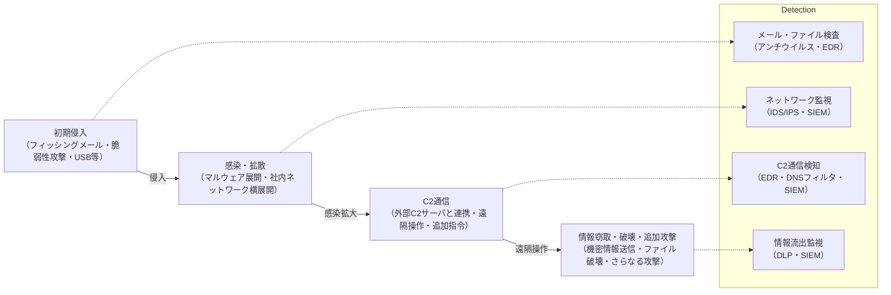
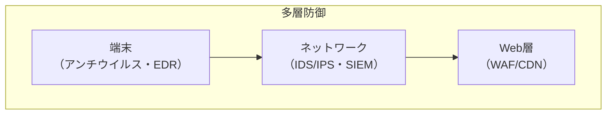

## 概要

本章では、現代のサイバー攻撃手法（マルウェア、DoS/DDoS、C2通信など）と、それに対抗する防衛策（検知・遮断・対応）の理論と実践を体系的に解説する。攻撃の構造・流れ・被害例から、IOC（Indicator of Compromise）やEDR（Endpoint Detection and Response）など最新の検知・対応技術まで、実務・試験対策の両面で役立つ知識を身につける。

サイバー攻撃は年々高度化・巧妙化しており、単なるウイルス対策だけでは防ぎきれない。攻撃の全体像（侵入→感染→拡散→遠隔操作→情報窃取）を理解し、各段階での検知・防御・対応を多層的に設計することが重要である。防衛策は「技術」「運用」「体制」の三位一体で考える。

---

## 1. 主要な攻撃手法

サイバー攻撃は多様な手法が組み合わされる。代表的な攻撃とその仕組み・対策を詳しく解説する。

### 1.1 マルウェア（ウイルス・ワーム・トロイの木馬等）

- **攻撃構造**：
  - マルウェアは「悪意あるプログラム」の総称。ウイルスは自己複製し他ファイルに感染、ワームはネットワーク経由で自動拡散、トロイの木馬は正規ソフトを装い侵入する。
  - 感染経路はメール添付、Webダウンロード、USBメモリ、脆弱性を突いた自動感染など。
  - 近年は「ランサムウェア」（ファイル暗号化＋身代金要求）や「ボットネット」（遠隔操作端末群化）が主流。
- **被害例**：
  - 企業の業務ファイルが暗号化され復旧不能、顧客情報の漏洩、端末が攻撃の踏み台化。
- **対策**：
  - アンチウイルスソフト導入・定期スキャン、OS・ソフトのアップデート（脆弱性修正）、権限管理（管理者権限の限定）、不審メール・添付ファイルの開封禁止。
  - 実践例：社内端末は自動アップデート・USB利用制限・アンチウイルス一括管理。

### 1.2 DoS/DDoS攻撃

- **攻撃構造**：
  - DoS（Denial of Service）は単一端末から大量リクエストでサービス妨害。DDoS（Distributed DoS）は複数端末（ボットネット等）から同時攻撃。
  - SYN Flood（TCP接続要求の大量送信）、UDP Flood（無意味なパケット送信）など手法多数。
- **被害例**：
  - Webサイトの長時間停止、業務システムの利用不能、顧客サービスの信頼失墜。
- **対策**：
  - WAF（Web Application Firewall）による異常検知・遮断、CDN（Content Delivery Network）による負荷分散、レートリミット（単位時間あたりのリクエスト制限）、ブラックホールルーティング（攻撃トラフィックの破棄）、クラウド型DDoS対策サービス。
  - 実践例：クラウドサービスはDDoS対策オプションを有効化、WAFで攻撃パターン自動遮断。

### 1.3 C2通信（Command & Control）

- **攻撃構造**：
  - マルウェア感染端末が外部の攻撃者サーバ（C2サーバ）と通信し、遠隔操作や追加攻撃指令を受ける。C2通信はHTTP/HTTPS、DNS、独自プロトコルなど多様。
  - 攻撃者はC2経由で情報窃取、追加マルウェアのダウンロード、他端末への横展開を指示。
- **被害例**：
  - 機密情報の外部送信、社内ネットワーク全体への感染拡大。
- **対策**：
  - ネットワーク監視（IDS/IPS）、DNSフィルタリング（不審ドメイン遮断）、EDRによる異常通信検知。
  - 実践例：EDRでC2通信を自動隔離、SIEMで不審な外部通信を相関分析。

---

## 2. 攻撃の流れと検知ポイント

攻撃は複数段階で進行する。各段階での検知・遮断が重要。

1. 初期侵入：フィッシングメール、脆弱性攻撃、USB等で端末に侵入。
2. 感染・拡散：マルウェア展開、社内ネットワークへの横展開。
3. C2通信：外部サーバと連携し、遠隔操作・追加攻撃指令。
4. 情報窃取・破壊・追加攻撃：機密情報送信、ファイル破壊、さらなる攻撃。

各段階での検知・遮断が重要。特にC2通信の検知は被害拡大防止の鍵。

### 攻撃の流れ

---

## 3. 防衛技術の基礎

攻撃を防ぐには、複数の技術を組み合わせて「多層防御」を実現する。各技術の仕組み・導入ポイントを理解しよう。

| 技術               | 解説                                                                     | 代表ツール・規格         |
| ------------------ | ------------------------------------------------------------------------ | ------------------------ |
| **アンチウイルス** | 既知マルウェアのシグネチャ検知・隔離。未知型は振る舞い検知も活用。       | Windows Defender, ESET   |
| **EDR**            | 端末の振る舞い監視・異常検知・自動隔離。感染拡大やC2通信も検知。         | CrowdStrike, SentinelOne |
| **SIEM**           | ログ統合・相関分析によるインシデント検知。複数システムのログを一元管理。 | Splunk, Wazuh            |
| **WAF/CDN**        | Web層の攻撃遮断・負荷分散。DoS/DDoS対策にも有効。                        | AWS WAF, Cloudflare      |
| **IOC管理**        | 攻撃兆候（IP,ドメイン,ファイルハッシュ等）の収集・共有。                 | MISP, VirusTotal         |

### 多層防御

各層で異なる役割を担い、攻撃の侵入・拡大を防ぐ。

---

## 4. 実践的な防衛策

- **多層防御**：端末（アンチウイルス・EDR）、ネットワーク（IDS/IPS・SIEM）、Web層（WAF/CDN）で複数技術を併用。単一障害点を排除。
- **定期スキャン・アップデート**：OS・ソフト・ウイルス定義の最新化。脆弱性放置は攻撃リスク増大。
- **権限管理・最小権限原則**：不要な管理権限・共有フォルダの排除。管理者権限は限定的に。
- **インシデント対応体制**：CSIRT（Computer Security Incident Response Team）設置、初動対応手順の整備。被害拡大防止。
- **IOC活用**：攻撃兆候（IP,ドメイン,ハッシュ等）を収集・共有し、早期検知・遮断。MISP等で情報連携。
- **教育・訓練**：利用者・管理者へのセキュリティ教育、インシデント対応訓練も重要。

---

## 5. 最新動向と課題

- **EDR/XDRの普及**：EDRは端末、XDRはクラウド・ネットワーク全体を横断的に監視・防御。複数システムの連携で高度な検知・対応。
- **AI型マルウェア検知**：未知の攻撃パターンも機械学習で検知。従来型アンチウイルスの限界を補完。
- **攻撃の高度化・自動化**：ファイルレス攻撃（ファイルを残さずメモリ上で動作）、サプライチェーン攻撃（委託先・部品経由の侵入）等への対応強化。
- **IOC共有の国際連携**：MISP等によるグローバルな攻撃情報共有。国際的な連携で早期検知・遮断。
- **EDR・SIEM・IOCの連携強化**：複数技術を組み合わせ、インシデント対応力を高める。

---

## 6. 試験対策の観点

- マルウェア／DoS／C2通信の「構造→被害→対策」を図解・事例で整理
- IOC・EDR・SIEMの役割と導入ポイント、連携の重要性
- 多層防御・インシデント対応体制の設計思想と実践例
- 最新動向（EDR/XDR, AI型検知, IOC共有等）の特徴と導入メリット

実務・試験ともに「攻撃例→検知・防御策→運用ポイント」の流れで体系的に理解することが重要。
