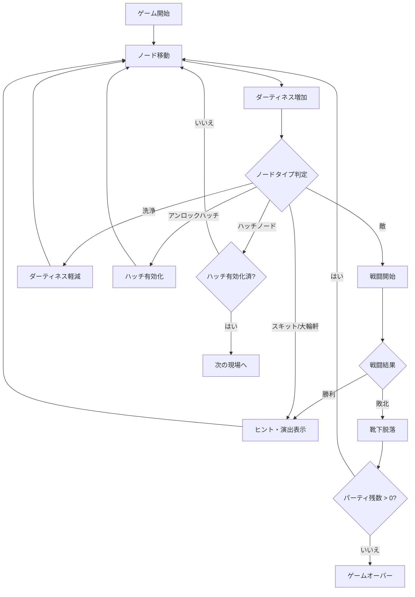

## 1. 概要

### タイトル
**Dirty Socks**

### キャッチコピー
**よごれのつよさ**

### コンセプト
- 靴下が汚れるほど力を増すが、UIはどんどん汚れて見づらくなる
- 毎回変わるマップで探索するローグライク体験
- コメディとホラーが入り混じる寸劇や隠しコマンドで発見の楽しみ
- 強くなることと見えなくなることのジレンマが遊びの軸

### プレイスタイル
- **iOS限定**
- **シングルプレイ**
- **1ステージあたり5〜20分**

---

## 2. 世界観
- 片方だけよく行方不明になる、やさぐれ靴下たちが主人公
- 正義感はなく、悪友のようなノリで冒険する
- 視界の代わりはUIログとネットワークマップ
- ゴールは「脱出ハッチ」を探し当てること

---

## 3. ノード（場所）
マップは複数の「ノード」で構成されます。

| ノード                 | 内容                                           |
| ---------------------- | ---------------------------------------------- |
| START                  | ゲーム開始地点                                 |
| 敵                     | 戦闘が発生。勝てばハッチのヒント入手           |
| 洗浄                   | ダーティネスを軽減。ただし少し弱体化する        |
| スキット               | ミニドラマやホラー演出。ヒントも隠されている   |
| 大輪軒                 | 飲食店。寄り道で追加ヒントが手に入る           |
| アンロックハッチノード | 到達するとハッチが有効化される                  |
| ハッチノード           | 有効化後にたどり着けば、その現場から脱出成功   |

### 期間限定イベント
- 特殊スキット
- 限定大輪軒

---

## 4. 遊びの流れ
- 六角形セルのマップを一筆書きで探索
- 靴下キャラ4体を操作し、全18現場の脱出に挑戦
- 脱出条件：
  1. 1体がアンロックハッチ到達
  2. 別の1体がハッチ到達

### 制約
- 一度通ったセルは再通行不可
- 靴下同士はすれ違えない

### ダーティネス
- 移動するたびに蓄積
- **軽度**：文字ログが濁る
- **中度**：グリッチやモザイク演出
- **重度**：UIがほぼ使えなくなる
- 洗浄ノードで軽減可能
- 汚れはデメリットだけでなく、戦闘や探索を有利にする「力」にもなる

### プレイモード
プレイヤーは2つのモードから選択して現場へ挑戦できる。

- **Casual（フリープレイ）**  
  - 自由なシードでマップを生成
  - 記録は「自己ベストスコア」としてのみ保存
  - ランキングには反映されない
  - 練習や気軽なプレイ向け

- **Trial（ランキングイベント）**  
  - 運営が定義する「10日ごとの固定シード」でマップ生成
  - 誰がプレイしても同一条件
  - 記録はランキングに反映
  - イベント名は「Trial XX」（XX = 実施回数）としてカウントアップ
 

---

## 5. キャラクターと育成
- 靴下キャラは8つのパラメータを持つ
- XPを振り分けて自由に成長可能
- パラメータによって、ダーティネスの溜まり方やイベント発生が変化

| パラメータ                | 意味       | 影響する要素                       |
| ------------------------- | ---------- | ---------------------------------- |
| Vexation［もどかしさ］     | 行動に対する苛立ち | 移動コスト・選択肢に影響           |
| Ineptness［拙さ］          | 技量不足         | 戦闘の失敗率に影響                 |
| Dolour［嘆き深さ］        | 感情の重さ       | ダーティネスの蓄積量               |
| Fragility［脆さ］         | 壊れやすさ       | 全滅リスクや回避判定に影響         |
| Baseness［浅ましさ］      | 卑しさ           | 戦闘・トラップ回避に影響           |
| Precarity［危うさ］       | 不安定さ         | UI汚染による探索制約に影響         |
| Karmic Burden［業の深さ］ | 因果の重さ       | 特殊イベント発生率に影響           |
| Indecorum［はしたなさ］   | 不作法さ         | NPC反応・隠しヒント出現率に影響    |

### ゆったり成長曲線
- 初日：到達現場数 約3
- 30日：到達現場数 約6
- 1年：到達現場数 約12
- 3年：到達現場数 約18

---

## 6. 報酬
- **エメラルド**：通貨（スキン購入・広告削除）
- **XP**：キャラクター育成用

入手手段：
- ステージクリア
- 日次ミッション
- 敵図鑑コンプリート
- 隠しノード発見

---

## 7. 敵図鑑
- 遭遇した敵が自動登録され、図鑑が埋まっていく
- 種類・レア度・履歴を閲覧可能
- コンプリート報酬としてエメラルドやXPを獲得

---

## 8. HATCH探索と示唆
- 示唆は「確定情報」：方角や種類などを教えてくれる
- 演出例：文字逆回転、ブラックアウト、次回予告、金文字やゼブラ柄
- 重要情報はUIログで**強調表示**
- 超低確率イベント（1/65536）では「希少靴下」と契約できる

---

## 9. 裏コマンド・隠し示唆
- 確定ではなく「ほのめかし」として表現
- 発見の驚きとSNSでの共有を狙う

### 発動例
- 画面端を3回タップ → HATCH方向が一瞬点滅
- デバイスを振る → 「風の音」ログ＋端末バイブ
- START地点で特定スワイプ → 「靴下の古い記憶」演出
- 15秒無操作 → UIにじみで暗示

---

## 10. ステージ生成
- 無向グラフで毎回異なるマップを自動生成
- 全18現場（par777設計）
  - ショート：5
  - ミドル：9
  - ロング：4

### 生成手法
- Cellular Automataで密度調整
- BSPで通路に変化を持たせる

### 探索保証
- STARTとHATCHは必ず連結
- Union-Findで検証
- Dijkstra / A*で最短経路チェック
- 戦略ルートはTSP的に評価

---

## 11. 技術と開発体制
- **iOS限定・個人開発**（週10時間想定）
- SwiftUIベースで軽量設計
- UIはテキストログ中心
- グリッチやモザイク演出で視覚的変化
- VFXはHoudini 21.0で作成

---

## 12. マネタイズ
- 基本無料＋アプリ内課金
  - キャラスキン（色・柄違い）
  - 広告削除
- ガチャなし
- ステージパック不要（自動生成で新鮮さを維持）
