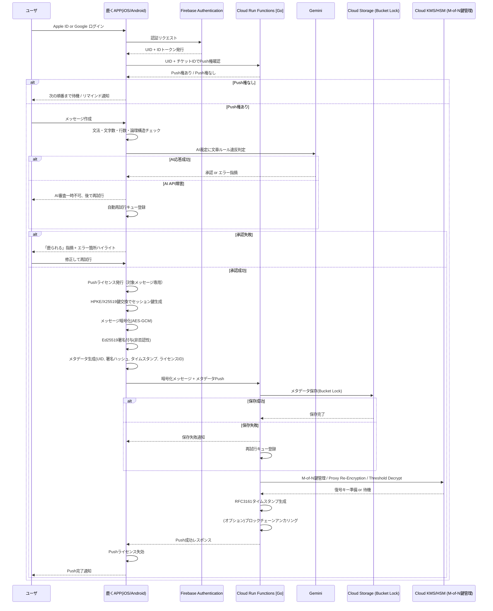

## 1. 設計コンセプト
「鹿く」は、希薄化したデジタルコミュニケーションに対抗し、思考の圧縮と表現責任を核に据えた新しい対話文化を提案します。
送信メッセージは誤字脱字や論理的不整合、意図の曖昧さを精査され、合格したものだけがキューに登録されます。
受信者は自分のタイミングで取得可能で、通知や即時応答に縛られません。
この仕組みにより、送信者が自発的に理解される責任を負う文化が醸成され、意味と責任を伴った質の高い情報交換が実現します。

### 1.1 Core Values

#### メッセージは思考の圧縮物
一語一句に意味を込め、論理的で洗練された文章作成を習慣化。

#### Pull主体UX
情報は受動的に届くのではなく、ユーザーが自ら取り出す形式で取得。

#### AI裁定によるPushの承認制
論理整合性や表現の適切さをAIが評価し、承認された場合のみPush可能。

#### 責任あるコミュニケーション文化
Push権とPushライセンスにより、発言への責任感を内面化。

#### 話題単位の議論管理
チケット単位で議論を体系化し、従来の五月雨式を脱却。

---

## 2. UX設計：Push/Pull インタラクション

「鹿く」のUXは、ユーザーが主体的に思考し、責任を持ってPushすることを促す設計です。

### 2.1 会話の単位：チケット

* **話題の明確化**：すべての議論はチケットとして開始され、件名が主題を明確化。
* **情報階層の整理**：件名が一次情報、Pushされるメッセージが二次情報として位置づけられ、情報構造を可視化。
* **チケットタイプ**：
  * **通常チケット**：担当者を設定し、特定課題やプロジェクト進捗を議論。日次で締め、アーカイブ可能。
  * **daylogチケット**：自動生成されるフリーディスカッション用チケット。日次リフレッシュされ、軽い情報共有や雑談に使用。AI裁定は軽量モードで運用。

### 2.2 Push権とPushライセンス

#### Push権の管理
公平な情報発信を確保するため、Push権は参加者間で順次委譲。連続Pushは禁止。

#### Pushライセンスによる発信制御
- AIが文法・論理チェックを行い、文字数・行数・主語述語の要件を満たした場合のみPushライセンスを付与。
- AIは誤字脱字や論理不整合、話題逸脱を検知し、修正指示（「鹿られる」）を返すことで文章能力向上に寄与。
- Push完了と同時にライセンスは失効。

#### 発言責任の明確化
Push完了後のメッセージは編集・削除不可。発言への責任を内面化させ、質の高いコミュニケーション風土を醸成。

### 2.3 Pull主体の情報取得

* **Pull型メッセージ取得**：ユーザーは自分のタイミングでキューからメッセージを取得。
* **通知の最適化**：Push権到来のリマインド通知は行うが、即時レスを強制する通知は回避。
* **即時性からの解放**：ユーザーは自分のペースでPullを実行可能。

---

## 3. データ保存設計

| 保存対象           | 内容                            | 形式      | TTL/期限     | 備考                       |
| :----------------- | :------------------------------ | :-------- | :----------- | :------------------------- |
| 暗号化メッセージ   | AES-GCM暗号化本文               | バイナリ  | 30〜90日     | TTL後は不可逆消去          |
| メタデータ         | UID、チケットID、署名ハッシュ等 | JSON      | 永続（WORM） | 改ざん不可、証跡性保証     |
| AI審査ログ         | 承認結果、逸脱スコア、指摘箇所  | JSON      | 最大90日     | 推敲履歴・教育効果の証跡   |
| Push権履歴         | 順番回転情報、リマインドログ    | JSON      | 約90日       | 公平性UX維持               |
| タイムスタンプ証跡 | RFC3161準拠TS、Ed25519署名      | JSON/署名 | 永続（WORM） | 法的効力を持つ非改ざん証跡 |

---

## 4. 収益化構造

段階的なプラン設計で、個人利用から企業運用まで対応。

### 4.1 プラン概要

| 機能                                  | カジュアルプラン (無料) | ビジネスプラン (有料) |
| :------------------------------------ | :---------------------- | :-------------------- |
| AI裁定 (基本機能)                     | ○                       | ○                     |
| Push権/Pushライセンス                 | ○                       | ○                     |
| チケットシステム                      | ○                       | ○                     |
| グループ上限 (20人)                   | ○                       | ○                     |
| メッセージ保存 (短期)                 | ○                       | ○                     |
| 文字アイコンアセット販売              | ○                       | ○                     |
| **AI審査ログ永続保存**                | ✕                       | ○                     |
| **WORMによるメタデータ永続保管**      | ✕                       | ○                     |
| **タイムスタンプ証跡**                | ✕                       | ○                     |
| **HSMによる鍵管理 (M-of-N, PRE, TD)** | ✕                       | ○                     |
| **監査証跡・法的対応**                | ✕                       | ○                     |
| **専用API連携 (予定)**                | ✕                       | ○                     |

### 4.2 文字アイコンアセット販売

* アプリ内キーボードを独自実装し、Pushメッセージの視覚表現を拡張。
* 有料アセット提供で、ユーザーの自己表現を広げつつ開発を支援。

### 4.3 ビジネスプラン付加価値

* メッセージ本文の永続アーカイブ
* AI審査ログの長期保存
* WORMによるメタデータ永続化
* RFC3161タイムスタンプ付与
* HSMによる高度鍵管理（M-of-N, PRE, Threshold Decrypt）
* 監査証跡・法的対応

### 4.4 セキュリティの担保

* E2EEによりサーバー側で復号不可
* Pushライフサイクルに応じた鍵管理
* 非否認性（Ed25519署名）
* HSMによる高セキュリティ鍵管理
* WORMストレージとタイムスタンプ
* フォールバックとブレイクグラス手続き
* 法的コンプライアンス対応

---

## 5. 技術アーキテクチャ

### 5.1 クライアントサイド（Swift UI）

* Push承認前の文法・論理チェックをローカルで実行
* E2EE（HPKE/X25519セッション鍵、AES-GCM暗号化、Ed25519署名）
* Pull型メッセージ取得UIを提供

### 5.2 サーバサイド (Google Cloud)

* **Cloud Functions (Go)**：暗号化・署名検証、AI審査連携、メタデータ管理
* **Cloud Storage (Bucket Lock)**：メッセージ・メタデータ永続化、WORM
* **Cloud KMS/HSM**：高セキュリティ鍵管理、PRE、Threshold Decrypt
* **Gemini API**：文法・論理審査、逸脱スコア算出
* **タイムスタンプ・ブロックチェーンアンカリング**

### 5.3 システム連携シーケンス

---

## 6. サービス維持費用の概算

| MAU      | Cloud Run | Cloud Storage | Cloud KMS/HSM | Gemini API | 月額合計 |
| :------- | :-------- | :------------ | :------------ | :--------- | :------- |
| 100人    | $10       | $10           | $6            | $50        | $76      |
| 1,000人  | $100      | $100          | $60           | $500       | $760     |
| 10,000人 | $1,000    | $1,000        | $600          | $5,000     | $7,600   |

---

## 7. ロードマップ

* 多言語対応
* 組織内ダッシュボードによるコミュニケーション品質可視化
* 論理的でわかりやすい文章を書く力を高める学習コンテンツ（『理科系の作文技術』に基づく）
