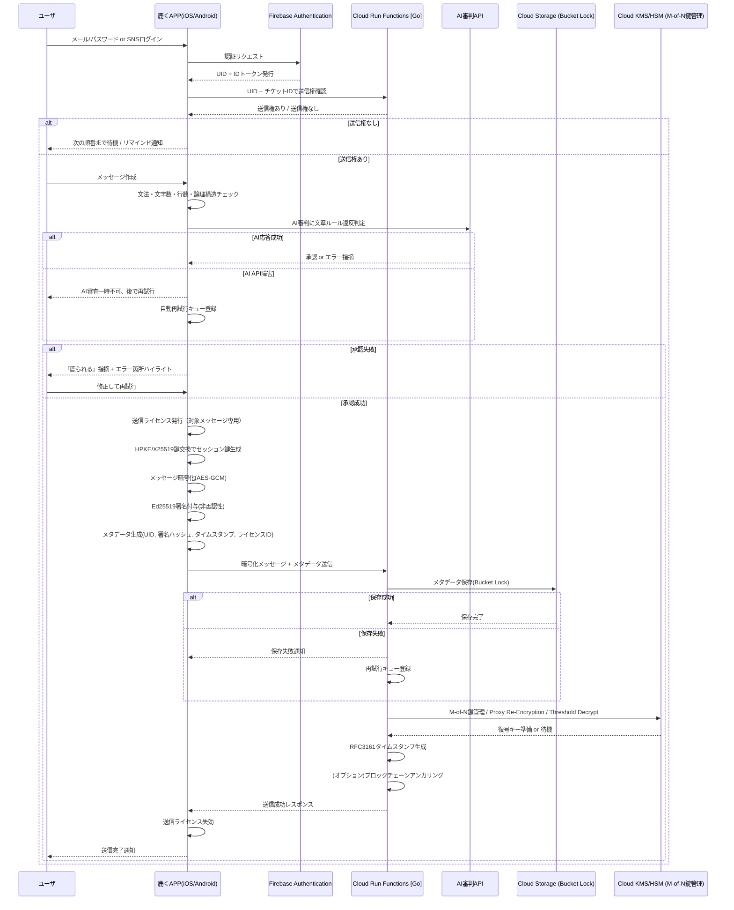

## 1. コンセプト
- **メッセージは思考の圧縮物**：文章生成は思考の検証であり、投稿は自己責任を伴う行為
- **受信者主体UX**：通知・即レス文化に依存せず、Pull型問い合わせで主体的に取得
- **送信権**：会話の公平性を担保する「順番権」。連投不可、送信後は相手に委譲
- **送信ライセンス**：AI審判によって与えられる「一回限りの免許」。送信完了と同時に失効
- **AIは裁定者**：誤字脱字や論理不整合を検知し「鹿られる」指摘を返す。承認がなければ送信不可
- **会話基盤＝チケット**：従来のトークルームではなく、話題（チケット）単位で構成。参加者は二次情報
- **文化醸成**：論理性・文章力・礼節・責任意識を自然に内面化

---

## 2. UX設計
| 要素           | 内容                                                           |
| -------------- | -------------------------------------------------------------- |
| チケット基盤   | 会話開始には必ずチケット作成。件名が一次情報、参加者は二次情報 |
| 文章制約       | 1文80字以内・最大3行・主語述語必須・論理構造検証               |
| 送信権制御     | 追いメッセージ不可、編集不可、連投禁止。送信完了後は権利委譲   |
| 送信ライセンス | AI承認による一回限りの送信免許。送信後は失効                   |
| グループ上限   | 最大20人。送信権回転の効率と文化醸成を重視                     |
| AI審査         | 文法／論理エラー検出、逸脱スコア算出、違反時は修正要請         |
| リマインド通知 | 受信者主体で送信権到来を通知。強制圧迫は回避                   |
| メッセージ取得 | **キュー問い合わせ式**。PushではなくPull型で受信               |

---

## 3. コミュニケーション運用方針
### 3.1 チケットタイプ
- **通常チケット**
  - 担当者設定あり。削除（Eliminate）／アーカイブ（Archive）が可能
  - 日次で締め、履歴を体系的に収蔵
- **daylogチケット**
  - 自動生成・担当者なし。日次リフレッシュされ雑談を吸収
  - アーカイブに残存。AI審判は軽量モード

### 3.2 メッセージ管理
- **Eliminate**：本文のみ不可逆削除、メタデータはWORMで保持
- **Archive**：本文を収蔵し、専用ビューで参照可能
- **キュー管理**：送信時にキュー投入 → 受信者のPullで取り出し
- **日次締め**：文化醸成・監査証跡のためログを確定保存

---

## 4. 話題逸脱検知
- メッセージを特徴量ベクトル化しチケットごとにクラスタリング
- cosine similarityで判定し閾値を下回れば新チケット提案
- 逸脱スコアをメタデータに付与 → 後続分析で利用可能

---

## 5. 文化醸成・教育的価値
- 強制推敲 → 思考の圧縮と論理整備の習慣化
- 送信権と送信ライセンスで「思考責任」と「表現責任」を二重に教育
- 20人上限・Pull型取得で即レス文化から解放
- 「送信できた」こと自体が知的ステータス
- 雑談はdaylogで受け止め、重要事項は通常チケットで厳格管理

---

## 6. 技術仕様
### クライアント（iOS/Android）
- 文法・論理検証ローカル実行
- AI審判APIで最終承認／逸脱判定
- HPKE/X25519によるセッション鍵交換（TTL後破棄）
- AES-GCMによる暗号化
- Ed25519署名による非否認性確保
- Pull型メッセージ取得UI

### Google Cloud
- **Cloud Functions**：暗号化・署名・AI審査・メタデータ管理
- **Cloud Storage**：暗号化本文は短期保存（30〜90日）。メタデータ・署名・送信権履歴はWORM保存
- **Cloud KMS/HSM**：M-of-N鍵管理、Proxy Re-Encryption、Threshold Decrypt、ブレイクグラス手続き対応

---

## 7. データ保存設計
| 保存対象           | 内容                                           | 形式      | TTL/期限     | 備考                       |
| ------------------ | ---------------------------------------------- | --------- | ------------ | -------------------------- |
| 暗号化メッセージ   | AES-GCM暗号化本文                              | バイナリ  | 30〜90日     | TTL後は不可逆消去          |
| メタデータ         | 送信者ID、受信者ID、チケットID、署名ハッシュ等 | JSON      | 永続（WORM） | 改ざん不可、証跡性保証     |
| AI審査ログ         | 承認結果、逸脱スコア、エラー箇所               | JSON      | 最大90日     | 推敲履歴、教育効果の証跡   |
| 送信権履歴         | 順番回転情報、リマインドログ                   | JSON      | 約90日       | 公平性UX維持               |
| タイムスタンプ証跡 | RFC3161準拠TS、Ed25519署名                     | JSON/署名 | 永続（WORM） | 法的効力を持つ非改ざん証跡 |

---

## 8. セキュリティ設計
- E2EE：AES-GCM＋HPKE/X25519
- TTL後は鍵削除で完全不可逆化
- Ed25519署名による非否認性
- HSMでM-of-N鍵管理、Proxy Re-Encryptionで限定復号
- WORM保存＋タイムスタンプ証跡で監査対応
- フォールバックとブレイクグラス手続きで障害時対応

---

## 9. 法令・監査対応
- 個人情報保護法／電子帳簿保存法／サイバーセキュリティ基本法に準拠
- 裁判所・監査法人対応可能
- 本文はTTL後削除、メタデータは永続保存
- 重要業務メッセージは監査証跡つきで長期復号可能

---

## 10. コスト概算（目安）
- Cloud Functions：5,000ユーザ規模なら無料枠内
- Cloud Storage：短期本文450GBで約 $12/月
- Cloud KMS/HSM：鍵操作で $2〜5/月
- Firestore＋Cloud Functionsで軽量ベクトル検索：$20〜40/月
- **合計：$80〜100/月（AI審査APIは別途）**
