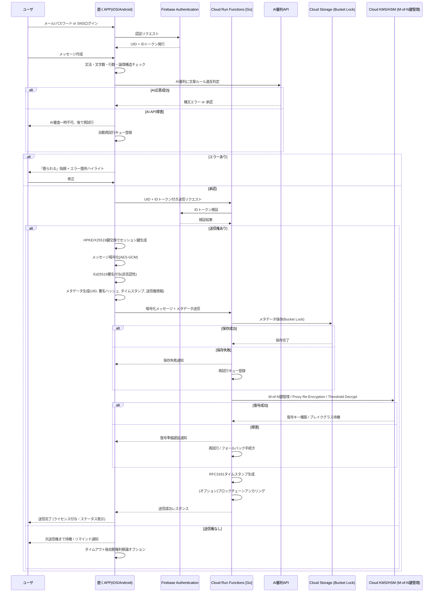

## 1. コンセプト
- **メッセージは思考の圧縮物**
- **送信権＝ライセンス**：送信できること自体が知的証明・文化的ステータス
- **受信者主体UX**：焦りや即レス義務感を排除
- **AIは補助ではなく審判**：文章ルール違反を指摘
- **文化醸成**：論理性・文章力・礼節・責任意識を自然に教育

---

## 2. UX設計
| 要素           | 内容                                                        |
| -------------- | ----------------------------------------------------------- |
| 文章制約       | 1文80字以内、最大3行、主語・述語・論理順序必須              |
| 送信権制御     | 追いメッセージ不可、順番待ち制、連投禁止（1ユーザ連続不可） |
| グループ上限   | 20人まで、文化醸成・送信権回転管理を最適化                  |
| AI審査         | 違反は「鹿られる」、修正後送信可                            |
| ライセンス獲得 | 送信成功時に視覚フィードバック、ステータス表示              |
| リマインド通知 | 受信者主体で送信権到来を通知、圧迫感なし                    |

---

## 3. コミュニケーション運用方針
### 3.1 チケットタイプ
- **通常チケット**
  - 担当者設定あり：削除（Eliminate）／アーカイブ（Archive）が可能
  - 日付単位で締め、ユーザ間のやり取りを整理・収蔵
- **daylogチケット**
  - 自動生成され担当者なしの特殊チケット
  - 日次リフレッシュ、雑多会話は消えずアーカイブ
  - AI審判は軽量モードで任意適用

### 3.2 メッセージ管理
- **Eliminate**：不可逆削除（本文のみ）、WORMメタデータは保持
- **Archive**：メッセージ収蔵、別メニューで閲覧可能
- 日次締めで文化・法令・監査証跡を保持

---

## 4. 文化醸成・教育的価値
- 強制推敲・文章圧縮・論理構造必須
- 送信権・ライセンス概念で思考責任・礼節を自然教育
- 連投禁止・グループ20人上限で焦りや即レス義務感を排除
- 「送信できたこと自体がステータス」という独自文化の醸成
- 雑談はdaylogチケット、重要なやり取りは通常チケットで確実に収蔵

---

## 5. 技術仕様
### クライアント
- iOS/Androidアプリ
- 文法・文字数・行数・論理構造チェック
- AI審判APIによる文章違反判定
- HPKE/X25519鍵交換でセッション鍵生成（TTL経過で鍵削除）
- AES-GCMによるメッセージ暗号化
- Ed25519署名（本文＋メタデータハッシュ）による非否認性

### Google Cloud
- Cloud Functions：暗号化・署名・AI審査・メタデータ処理
- Cloud Storage：短期暗号化メッセージ（TTL 30〜90日）、WORMストレージにメタデータ・署名・送信権情報永続保存
- Cloud KMS/HSM：M-of-N鍵管理、Proxy Re-Encryption、Threshold Decrypt、ブレイクグラス手続き対応

---

## 6. データ保存設計
| 保存対象           | 属性・内容                                                   | 形式          | TTL / 保存期限 | 備考                                   |
| ------------------ | ------------------------------------------------------------ | ------------- | -------------- | -------------------------------------- |
| 暗号化メッセージ   | AES-GCM暗号化本文                                            | バイナリ      | 30〜90日       | TTL経過後は復号不可                    |
| メタデータ         | 送信者ID、受信者ID、タイムスタンプ、署名ハッシュ、送信権情報 | JSON          | 永続（WORM）   | 改ざん不可、法令証跡・監査対応         |
| AI審査ログ         | AI判定結果、エラー箇所                                       | JSON          | 最大90日       | 推敲・文化醸成の証跡                   |
| 送信権履歴         | 権利回転情報、リマインド履歴                                 | JSON          | 90日程度       | UX維持・送信順序管理                   |
| タイムスタンプ証跡 | RFC3161タイムスタンプ、署名                                  | JSON/バイナリ | 永続（WORM）   | 法的非改ざん証跡、裁判所・監査対応可能 |

---

## 7. セキュリティ設計
- E2EE（AES-GCM＋HPKE/X25519）、TTL経過で鍵削除
- Ed25519署名による非否認性
- KMS/HSMでM-of-N管理、Proxy Re-Encryptionで必要時のみ復号
- WORM保存＋タイムスタンプ＋署名による証跡保護
- 最小権限原則、送信権制御、障害時フォールバック対応

---

## 8. 法令・監査対応
- 個人情報保護法、電子帳簿保存法、サイバーセキュリティ基本法対応
- 行政監査・裁判所対応可能
- 本文はTTL後削除、メタデータ・署名・タイムスタンプは永続保持
- 重要業務メッセージは長期保存で復号可能

---

## 9. コスト概算（参考）
- Cloud Functions：無料枠内（5,000ユーザ未満）
- Cloud Storage：短期メッセージ450GBで約$12/月
- Cloud KMS/HSM：署名・暗号操作で$2〜5/月
- **合計**：$20前後（AI審査API除く）
