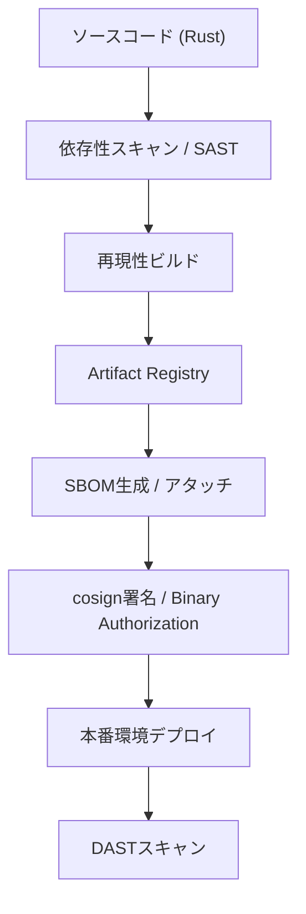

## 1. 基本設計原則

- **セキュリティ最優先（ゼロトラスト徹底）**：E2EE、最小権限、署名付きビルド、SBOM管理、監査ログ完全保持。**「信用しない、常に検証する」**を徹底。
- **クラウド最大活用＋オンプレ移行性確保**：
  - GCPの最新サービスを最大限利用
  - KMS/Auth/Storage/Logging 抽象化によりサービス差替え容易化
- **監査可能性・透明性**：
  - すべての操作・変更履歴・ビルドは証跡を残す
  - Immutable ログ・署名・SBOMをCI/CDに統合
- **高レベル運用要求の疑似再現**：
  - 強力な分類ラベルと承認フロー
  - デバイス・ユーザ認証強化
  - 完全オフラインモードによるエアギャップ運用
  - 改竄耐性と不可逆ログの保証

---

## 2. プラットフォーム構成

### 2.1 クライアント（TUI）

- **UIフレームワーク**：ratatui-rs
- **設計思想**：「描画・署名・キーホルダ」に徹し、業務ロジックはCloud Functionsに集約
- **主な機能**：
  - タスク表示／作成／更新／削除（UI描画のみ）
  - クライアント側E2EE暗号化・復号（ゼロナレッジ）
  - デバイス鍵管理とセキュアストレージ（Argon2id + Ed25519 + ChaCha20-Poly1305）
  - 強認証（WebAuthn/パスキー優先、パスワードは補助）+ MFA
  - オフライン署名キューで非同期同期
  - 分類ラベル・承認状態表示
  - 操作証跡の即時署名保存
  - **ローカル暗号化キャッシュ戦略**：
    - **永続化**：SQLCipherを用いたローカルDBに全暗号化データを保存。
    - **メモリ内保護の強化**：Libsodium/Rust crateによる**セキュアメモリバッファ**管理。復号化された平文データは必要最小限の時間のみメモリに保持し、直ちにゼロクリアする。
    - **キャッシュ更新**：差分同期（PATCH）を基本とし、失敗時はフル同期で整合性回復。

### 2.2 バックエンド

- **Google Cloud Functions**：
  - 業務ロジック・検証・監査の集約拠点
  - 認可・検証・監査・ルール適用と暗号メタ管理
  - 書き込み操作のゲートキーパー
  - 認証・署名・RBAC検証
  - 最小権限のサーバ設計（APIは最小情報のみ）
  - レート制限・WAF統合
  - 短寿命の参照型トークン管理
- **Firestore**：
  - 暗号化済データの保存（Cloud KMS CMEK/HSMで鍵管理）
  - メタデータ最小化（索引用ハッシュのみ、平文は保存しない）
  - 分類ラベル・非機密メタ
- **Security Command Center / Chronicle**：
  - 脅威検知・SIEM分析・監査レポート
  - 改ざん防止ログ（署名/immutable）
- **Cloud Armor / VPC Service Controls**：
  - WAF、DDoS防御、外部データ流出防止

---

## 3. セキュリティ設計指針

### 3.1 エンドツーエンド暗号化 (E2EE) - 必須要件

- **ゼロナレッジ設計**：クライアント側E2EEをデフォルト、サーバに平文を置かない
- タスクデータはクライアントで暗号化、クラウドには暗号文のみ保存
- **クライアント側鍵管理**：OSのセキュアストレージ（Keychain/Android Keystore）活用
- メタデータ最小化：索引用ハッシュのみサーバ保存、平文タイトル・本文は保存しない
- **安全な鍵導出**：Argon2idによる強固なKDF実装
- 将来オンプレ移行時も暗号形式互換性確保
- 改竄耐性：署名付きキュー + Immutable audit trail

### 3.2 鍵管理と鍵ライフサイクル

- **クラウド**：
  - Cloud KMS (CMEK) + Cloud HSM でマスター鍵管理
  - クライアント側でユーザ鍵保持、サーバには鍵ラップ情報のみ
- **オンプレ抽象化**：
  - Vault / PKCS#11 HSM で差し替え可能
  - KMSプロバイダ抽象インタフェース
- **鍵ライフサイクル管理（必須）**：
  - **ローテーション**：デバイス鍵は90日ごと、ユーザ鍵は1年ごとの自動ローテーションを推奨。侵害検知時にも即時ローテーションを発動。
  - **失効**：デバイス鍵の失効はCloud Functionsからデバイス証明書を取り消し、即座にアクセスを遮断。
  - **リカバリ**：鍵紛失時は、リカバリコードまたはShamir Secret Sharingによる「社会復旧」フローを通じてマスター鍵を再構築。再構築後、全てのタスクデータを自動で新鍵に再暗号化（バックグラウンドジョブ）。
- **量子耐性への考慮（追加）**：
    - 現行の暗号技術（Ed25519/X25519）を維持しつつ、将来的な**Post-Quantum Cryptography (PQC)**対応への移行パスを設計要件に組み込む。鍵交換・署名アルゴリズムのモジュール化により、NIST PQC標準化後の差し替えを容易にする。

### 3.3 認証・認可 - 必須要件

- **強認証**：WebAuthn/パスキー（FIDO2）を第一選択、パスワードは補助的位置づけ
- **MFA必須**：TOTP（RFC6238）またはU2F併用
- Firebase Auth + Cloud Functions Token検証
- **ゼロトラスト認証**：IAM 最小権限に加え、**コンテキストアウェアアクセス**（デバイス証明、地理的位置、リスクスコアに基づくアクセス条件）を厳格に適用。
- **短寿命参照型トークン**：アクセストークンはopaque、Refreshは回転式
- デバイス証明・WebAuthn/FIDO2サポート
- **パスワードレス推奨**：UI上でWebAuthn導入を積極的に促進

### 3.4 サプライチェーン保護 - 高優先要件とCI/CDフロー

- **CI/CDセキュリティ**：SAST/DAST/依存性スキャン、SBOM管理を必須化
- **署名付きビルド**：reproducible buildsによるサプライチェーン防御
- Binary Authorization / cosign により改竄防止
- OSS依存関係は Assured Open Source Software で検証
- **依存関係管理**：lockfile監査、npm audit CI失敗条件
- **透明性確保**：公開SBOM、Bug Bounty、透明性レポート提供
- **CI/CDパイプライン設計（論理図）**

### 3.5 ログ・監査 - 必須要件

- **最小限ログ**：検知に必要最小限、PII除去、改ざん防止（署名/immutable）
- **ログ項目制限**：イベント種別、ユーザIDハッシュ、タイムスタンプ、IP（トークン化）、成功/失敗フラグのみ
- **絶対禁止**：生のユーザコンテンツ（タスク本文）をログに含めない
- Immutable ログ、CMEK 暗号化、S3 immutableバケット保存
- オフラインモードでも署名付き操作キューで証跡確保
- 脅威検知・不正操作のアラート自動化
- **プライバシー配慮**：ログ収集はopt-in、匿名化（IPトークン化）実施

### 3.6 ネットワーク・境界防御

- VPC Service Controls による境界設定
- Cloud Armor による WAF/レート制御
- クラウド依存リスクは抽象化レイヤで最小化

### 3.7 バックアップ・災害復旧 - 必須要件

- **暗号化スナップショット**：復号にはユーザ側の鍵が必要
- **キー紛失対策**：リカバリコード（紙保存）、Shamir Secret Sharing社会復旧オプション
- 定期暗号化スナップショット、復旧テスト（年2回以上）実施
- メタ情報最小化、鍵ラップ付き安全保存
- オンプレでは同形式で復元可能
- **ユーザー向け回復**：リカバリコード、社会復旧、Shamir注意設計を提供

### 3.8 侵害対応 (IR)

- Cloud Monitoring + Alerting + 自動隔離アクション
- オンプレでは SIEM + Runbook で同等対応
- 改竄検知と即時隔離を自動化

---

## 4. 高レベル運用要求の疑似再現

- **分類管理**：機密分類ラベル (Top Secret / Secret / Confidential) + 最小公開原則
- **隔離・冗長化**：システム隔離、データ冗長化による可用性確保
- **オフライン能力**：完全オフライン／エアギャップモード + ローカル暗号化
- 認証強化: MFA + デバイス attestation + WebAuthn必須
- 署名付き操作キューによる改竄耐性
- Immutable audit trail によるすべての操作追跡
- **オフラインファースト**：ローカル暗号化、同期は選択的

---

## 5. オンプレ移行設計方針

- **抽象化レイヤ活用**：
  - KMS / Auth / Storage / Logging の統一インタフェース
- **データ移植性保証**：
  - 暗号文・ラップ鍵・メタ形式固定
- **署名・SBOM**：
  - 同一バイナリ、署名付き、CI証跡付き
- **IaC 展開**：
  - Helm / Terraform / docker-compose でクラウド・オンプレ共通化
- **移行ツール**：
  - export/import CLI で安全にデータ移行

---

## 6. 開発／運用方針

- **短期**：
  - E2EE + 書き込みゲート + SBOM/署名付きリリース
- **中期**：
  - CMEK/HSM、監査ログ出力、オフラインモード安定化
- **長期**：
  - On-prem deployment kit、FIPS/Common Criteria 対応準備

---

## 7. 技術的差別化ポイント

- 最高レベル疑似セキュリティ演出
- 署名済みバイナリ・SBOM・監査証跡完全公開
- オフラインエアギャップ運用モード
- 高度な分類ラベル・承認フロー
- Cloud依存リスク抽象化によりオンプレ移行可能
- **量子耐性への意識的準備（新規）**

---

## 8. ドキュメントと運用

- **ユーザ向け**：
  - 操作マニュアル、オフライン同期手順、キー管理手順
- **管理者向け**：
  - IR Playbook、バックアップ/リストア SOP、監査チェックリスト
- **開発者向け**：
  - SBOM、署名検証手順、CI/CD パイプライン文書

---

## 9. 脅威モデルと対策マップ

### 9.1 主要脅威と必須対策

| 脅威 | 必須対策 | 実装詳細 |
|------|----------|----------|
| **デバイス盗難・紛失** | クライアント暗号化、強認証、リモートワイプ | ローカルストレージ暗号化（SQLCipher）、OSセキュアストレージ、PIN/生体認証 |
| **サーバ侵害・DB漏洩** | ゼロナレッジE2EE、メタデータ最小化 | クライアント暗号化、サーバは暗号文と索引用ハッシュのみ保存 |
| **中間者攻撃（MITM）** | TLS 1.3必須、HSTS、証明書ピニング | エンドポイントTLS 1.3限定、強いCiphersuite、WAF保護 |
| **メモリ盗聴** | セキュアメモリバッファ、ゼロクリア | 平文データの最小時間保持とLibsodium/Rust crateによるセキュアメモリ管理 |
| **XSS/CSRF攻撃** | 厳格なCSP、短命トークン、入力サニタイズ | CSP限定、SRI、フレーム禁止、CORS whitelist |
| **サプライチェーン攻撃** | 依存性スキャン、署名付きパッケージ、SBOM | CI Dependabot/Snyk、署名付きビルド、npm audit |
| **内部脅威** | ゼロナレッジ設計、監査ログ、即時アラート | 運用者データアクセス不可、監査ログ必須、S即時アラート |

### 9.2 暗号・鍵管理詳細仕様

- **KDF**：Argon2id（プラットフォーム別推奨パラメータ）
- **公開鍵基盤**：Ed25519（署名） + X25519（鍵交換）
- **対称暗号**：ChaCha20-Poly1305（モバイル/ブラウザ最適化）
- **鍵階層**：マスター鍵（ユーザ保持）→デバイス鍵（各デバイス固有）
- **Key rotation**：鍵ラップ方式、段階的再暗号化（background job）
- **将来対応**：PQC耐性アルゴリズムへの容易なモジュール差し替え設計

### 9.3 認証・セッション詳細

- **第一選択**：WebAuthn（パスキー）FIDO2
- **補完**：TOTP（RFC6238）またはU2F
- **トークン設計**：短寿命参照型トークン（opaque）、回転式Refresh
- **レート制限**：IPベース＋アカウントベース、連続失敗時アカウント凍結

### 9.4 データモデル・同期と衝突解決の詳細

- **ローカル一次**：オフラインファースト、差分（PATCH）同期
- **衝突解決戦略**：
    - **デフォルト**：CRDT（Conflict-free Replicated Data Type）推奨により、自動で競合をマージ（例: タイムスタンプ/ハッシュに基づいた最新優先）。
    - **マージ承認フロー**：CRDTで解決不能な重大な競合（例：同時削除と同時編集）の場合、TUI上で明確に**「競合発生」**を通知し、ユーザーに**差分表示**と**「ローカル優先」「リモート優先」「手動マージ」**の選択肢を提示する。
- **検索**：クライアント側索引（ローカル全文検索）推奨

### 9.5 フロントエンド保護（高優先）

- **CSP厳格化**：Content Security Policy、SRI静的アセット
- **CORS厳密**：whitelist方式
- **依存管理**：最小限ライブラリ、定期更新、node_modules直読み回避

### 9.6 運用・検証

- **テスト統合**：SAST・DAST CI組み込み、依存関係週次監査
- **外部検証**：年1回以上ペネトレーションテスト、24時間以内緊急対応
- **監視検知**：SIEM相関検出、地理的検出、デバイスフィンガープリンティング

### 9.7 インシデント対応プレイブック

1. **検出**：初期トリアージ（影響範囲、攻撃ベクトル）
2. **隔離**：APIキーローテーション、侵害コンポーネント隔離
3. **通知**：内部、法務、必要時ユーザ通知
4. **フォレンジック**：immutable log、メモリダンプ
5. **復旧**：パッチ、再鍵配布、ユーザ通知
6. **ポストモーテム**：透明性レポート公開

### 9.8 UX・セキュリティ両立とユーザ教育

- **デフォルト安全**：E2EE有効、パスキー推奨
- **段階的導入**：軽量モード→E2EE移行パス提供
- **オンボーディング戦略（必須）**：
    1. **リカバリコードの出力強制**：初回ログインまたはパスキー設定時に、リカバリコードを画面に表示し、**紙に印刷/安全に保管**を強制する（スキップ不可）。
    2. **パスキー導入促進**：パスワード入力画面の前に、WebAuthn/パスキー導入への明確な導線とメリット（パスワードレス、フィッシング耐性）を提示する。
    3. **E2EEの透明性**：E2EEが有効であることをUIのステータスラインで常時表示し、ユーザーの安心感を高める。

### 9.9 API設計指針（実装直結）

- **ベースURL**：`https://[Region]-[ProjectID].cloudfunctions.net/api/v1`
- **主要エンドポイント構造**：
    - `POST /tasks/create`：新規タスク作成
    - `POST /tasks/sync`：差分同期（ローカル変更のアップロード/リモート変更のダウンロード）
    - `POST /auth/challenge`：WebAuthnチャレンジ発行
    - `POST /auth/attest`：WebAuthnアテステーション検証

- **リクエスト/レスポンススキーマ例 (`POST /tasks/create`)**

| フィールド | クライアント側挙動 | サーバ側検証/保存 |
|------------|----------------------|-------------------|
| `task_id` (UUID) | クライアント生成 | 存在・形式検証 |
| `ciphertext` (Base64) | タスク本文（ChaCha20-Poly1305暗号文） | バイト長検証、平文アクセス不可 |
| `meta_hash` (Base64) | 平文タイトル・本文からのKDFハッシュ | Firestoreの索引用に保存 (平文に戻せない) |
| `label` (String) | 機密分類ラベル（Secretなど） | RBACと照合し認可検証 |
| `signature` (Base64) | リクエストBody全体のEd25519署名 | デバイス鍵証明書と照合し**必須検証**。改竄耐性を保証。 |
| `auth_token` (Opaque) | 短寿命アクセストークン | Cloud Functionsで認証・認可検証 |

- **署名検証フロー**：
  1. Cloud Functionsが`auth_token`を検証し、ユーザー/デバイスの公開鍵を取得。
  2. リクエストBody（`task_id`, `ciphertext`, `meta_hash`, `label`など）から`signature`を除いた部分を抽出。
  3. 抽出したデータと取得した公開鍵で`signature`の正当性を検証。
  4. 署名が有効な場合のみ、後続の業務ロジック（`meta_hash`のDB保存、`ciphertext`のFirestore保存）に進む。

---

## 10. 追加設計要件（高セキュリティチェックリスト対応）

| 要件 | GCP実装例 | オンプレ抽象化 |
|------|-----------|----------------|
| エンドツーエンド暗号化 | libsodium / ChaCha20-Poly1305 | 同ライブラリで互換 |
| **ゼロトラストアクセス** | **Context-Aware Access (CA)** | デバイス証明書+RBACの厳格検証 |
| 鍵管理 | Cloud KMS CMEK + HSM | Vault / PKCS#11 HSM |
| 認証・認可 | Firebase Auth + FIDO2 / WebAuthn | Keycloak / WebAuthn |
| サプライチェーン保護 | Binary Authorization + cosign + Assured OSS | sigstore / SBOM / CI/CD |
| ログ監査 | Security Command Center + Chronicle | SIEM + WORMストレージ |
| ネットワーク境界 | Cloud Armor / VPC SC | NGINX/Envoy + ModSecurity |
| バックアップ/復旧 | Firestore Snapshot + CMEK | DBダンプ暗号化 + Vaultキー |
| 侵害対応 | Cloud Monitoring + Alerting | SIEM + Runbook |
| **セキュアメモリ** | Rust crate (Libsodium) | メモリゼロクリア強制 |

---

## 11. 採用検討項目（NICE-TO-HAVE）

- **オフラインファースト**：ローカル暗号化、同期は選択的
- **プライバシー学習**：ユーザ行動最適化は差分プライバシー（DP）で集計のみ送信
- **透明性向上**：Bug Bounty、公開SBOM、透明性レポート
- **高度な回復**：Shamir Secret Sharing社会復旧（運用リスク明示）
- **量子耐性への研究**：PQCアルゴリズムの先行評価とプロトタイピング

---

> この設計指針を守ることで、`vv` はTUIクライアントを「描画・署名・キーホルダ」に特化し、業務ロジック・検証・監査をCloud Functionsに集約する明確な責任分離を実現。クライアント側E2EE（ゼロナレッジ）をデフォルトとしつつ、**最高レベルのセキュリティと運用要求**を疑似的に提供し、将来オンプレ移行も視野に入れた最強クラスの TUI タスク管理アプリとして展開可能です。
